<div align="center">



# Embr

**Open source Web3 toolkit — deploy, encode, explore, track.**

[](https://opensource.org/licenses/MIT)
[](#)
[](#)

[**→ Open Embr**](https://embr-tools.workers.dev) · [Report Bug](https://github.com/embr-tools/embr/issues) · [Request Feature](https://github.com/embr-tools/embr/issues)

</div>

---

## Use it

**Embr lives at [`embr-tools.workers.dev`](https://embr-tools.workers.dev)**

Open it in your browser. No install, no account, no setup.

---

### Set it as your browser homepage

If Embr becomes part of your daily workflow, you can set it as your browser's new tab or homepage so it's always one click away.

**Chrome**
1. Go to `chrome://settings/onStartup`
2. Select **Open a specific page or set of pages**
3. Click **Add a new page** → paste `https://embr-tools.workers.dev`

**Firefox**
1. Go to `about:preferences#home`
2. Set **Homepage and new windows** → **Custom URLs**
3. Paste `https://embr-tools.workers.dev`

**Safari**
1. Preferences → **General**
2. Set **Homepage** → `https://embr-tools.workers.dev`

**Brave / Arc / Edge** — same as Chrome steps above.

---

## What's inside

| Feature | What it does |
|---|---|
| **Smart omnibar** | Paste any address, tx hash, ENS name, or function signature — Embr detects it and suggests the right action |
| **Contract Interact** | Load any deployed contract by address + ABI and call read/write functions |
| **Deploy** | Compile Solidity in-browser (solc.js) or paste raw bytecode from Hardhat/Foundry |
| **ABI Tools** | Encode calldata, decode transactions, inspect selectors, encode constructor args |
| **Networks** | Browse 1000+ chains from chainlist.org, test RPC latency, add to MetaMask |
| **Prices & Gas** | Live token watchlist (CoinGecko) + Ethereum gas tracker with slow/standard/fast tiers |
| **Notes** | Notion-style workspace: doc editor, kanban board, table view, sub-pages, folders |
| **Terminal** | Full command-line interface for every Embr action |
| **Contract Bookmarks** | Save address + ABI + chain for one-click access |
| **Pinboard** | Pin any panel or workflow to your home page |
| **Settings** | Accent color, sidebar position, custom search engine, keyboard shortcuts |

---

## Home page

The home page has a smart search bar that understands blockchain context. Type or paste anything:

| You type | What happens |
|---|---|
| `0x742d35Cc…` (40-char address) | Open in Interact · Copy · View on Blockscan · Bookmark |
| `0xd21b…` (64-char tx hash) | View on explorer · Decode calldata · Copy |
| `vitalik.eth` | Resolve ENS → opens address in Interact |
| `transfer(address,uint256)` | Compute 4-byte function selector |
| `0xa9059cbb` (4-byte selector) | Look up on 4byte.directory |
| `137` or `arbitrum` | Find chain in Networks |
| Anything else | Search on Google, DuckDuckGo, or ChatGPT |

Below the search bar, **Quick Actions** give you one-click access to the most common tasks. The **Pinboard** lets you pin shortcuts to your most-used panels, and **Contract Bookmarks** shows your saved contracts for instant loading.

---

## Contract Interact

1. Paste a contract address
2. Paste the ABI (JSON array)
3. Click **Load** — read and write functions appear as expandable panels
4. Click any function → fill in parameters → click **Read** or **Write**

Works with MetaMask, WalletConnect, and Phantom. No wallet needed for read-only calls.

Press `⌘B` to bookmark the current contract for instant access next time.

---

## Deploy

Two modes, switchable with the segment control at the top of the Deploy panel:

**Compile & Deploy**
- Paste Solidity source code
- Choose compiler version (0.7.6 – 0.8.25) and enable optimizer if needed
- Click **Compile** — errors appear in the output panel
- Click **Deploy to network** — MetaMask prompts for confirmation

**Open in Remix** — click the Remix button to send your source directly to remix.ethereum.org. Source is base64-encoded into the URL, no copy-paste needed.

**Raw Bytecode**
- Paste compiled bytecode from Hardhat, Foundry, or Remix artifacts
- Optionally paste ABI for constructor argument encoding
- Deploy directly without recompiling

---

## ABI Tools

Five tabs:

| Tab | Use it for |
|---|---|
| **Inspect** | Format or minify ABI, view all function selectors and event topics |
| **Encode** | Pick a function from the ABI, fill in values, get hex calldata |
| **Decode** | Paste a hex transaction and decode it back to readable parameters |
| **Constructor** | Encode constructor arguments for contract deployment |
| **Raw Encode** | Encode arbitrary Solidity types without an ABI |

---

## Networks

Browse 1000+ EVM chains from [chainlist.org](https://chainlist.org). Filter by Mainnet / Testnet / L2.

For each network you can:
- View all public RPCs with privacy ratings
- Click **Ping** to measure latency in milliseconds — green under 200ms, amber up to 600ms, red above
- Click **Ping all** or **Find fastest** to benchmark all RPCs automatically
- Click **Add to MetaMask** to add the chain in one click

---

## Prices & Gas

**Gas tracker** — Slow / Standard / Fast Gwei tiers from a public Ethereum RPC, with estimated USD cost for a standard ETH transfer.

**Token watchlist** — Search any token by name and add it to your list. Prices come from CoinGecko's free API with 24h percentage change. Updates every 60 seconds. Your watchlist is saved in the browser and persists across sessions.

---

## Notes

A lightweight Notion-style workspace stored entirely in your browser.

**Pages** — create from the sidebar `+` button. Right-click any page for sub-page, rename, or delete. Click the emoji icon to change it. Group pages into **Folders** with the `⊞` button.

**Three views per page:**

*Doc* — rich text editor. Markdown shortcuts work inline:

| Type | Gets converted to |
|---|---|
| `# ` | Heading 1 |
| `## ` | Heading 2 |
| `- ` or `* ` | Bullet list |
| `1. ` | Numbered list |
| `> ` | Blockquote |
| `[] ` | Checkbox |
| `/` | Slash command menu |

*Board* — Kanban by status. Drag cards between columns to update status. Double-click a card to edit.

*Table* — spreadsheet view of all tasks. Click a status badge to change it inline.

**Status colors:**
- ⬜ Not started · 🟦 In progress · 🟡 In review · 🟢 Done · 🔴 Cancelled

**Export / Import** — JSON backup from the sidebar arrow buttons.

---

## Terminal

Press `⌘ + backtick` or click **Terminal** in the status bar to open the slide-up terminal.

```
# Navigation
go home | interact | deploy | tools | networks | notes | prices | settings

# Wallet
connect mm              # connect MetaMask
connect phantom         # connect Phantom
wallet                  # show connected address and network
balance                 # fetch current ETH balance
gas                     # current Ethereum gas prices

# Contract tools
load 0x...              # load address in Interact
bookmark 0x...          # open bookmark modal for an address
encode                  # open ABI encoder
decode 0x...            # open decoder with hex pre-filled
keccak <text>           # compute keccak256 hash
selector <sig>          # compute 4-byte function selector
addr 0x...              # checksum an Ethereum address

# Notes
note new                # create a new page
note list               # list all pages

# System
theme #6366f1           # change accent color
settings                # open settings panel
export                  # export all data as JSON
version                 # show version
clear                   # clear terminal
help                    # show all commands
```

Arrow keys scroll through command history.

---

## Settings

Open with `⌘8` or click **Settings** in the sidebar.

| Setting | What it does |
|---|---|
| Accent color | 7 presets — changes buttons, highlights, active states instantly |
| Sidebar position | Left or Right |
| Hide sidebar | Collapses sidebar for more workspace |
| Default search fallback | Google · DuckDuckGo · ChatGPT · or your custom engine |
| Custom search engine | Any URL — use `{q}` as the query placeholder (e.g. `https://search.brave.com/search?q={q}`) |
| Export all data | Downloads one JSON with bookmarks, pins, notes, watchlist, and settings |
| Clear all data | Wipes everything from localStorage |

---

## Keyboard shortcuts

| Shortcut | Action |
|---|---|
| `⌘K` | Command palette |
| `⌘ + `` ` | Toggle terminal |
| `⌘B` | Bookmark current contract |
| `⌘1` | Home |
| `⌘2` | Interact |
| `⌘3` | Deploy |
| `⌘4` | ABI Tools |
| `⌘5` | Networks |
| `⌘6` | Notes |
| `⌘7` | Prices & Gas |
| `⌘8` | Settings |
| `/` | Focus home search (when on home, not typing) |
| `↑ ↓` | Navigate suggestions / terminal history |
| `Esc` | Close modal or terminal |

Every panel has a URL — `#interact`, `#deploy`, `#tools`, `#networks`, `#notes`, `#prices`, `#settings`. Refresh stays on the same panel.

---

## Wallet support

| Wallet | Networks |
|---|---|
| MetaMask | All EVM chains |
| WalletConnect | All EVM chains (free Project ID from cloud.reown.com) |
| Phantom | Solana + EVM |

Session persists — closing and reopening the tab with MetaMask connected will silently reconnect without a popup, until you manually disconnect.

---

## Sanctum — offline HD wallet

Embr ships with a companion tool called **Sanctum** accessible from the sidebar.

- Generate BIP39 mnemonic phrases (12/15/18/24 words)
- Derive addresses for ETH, BTC, SOL, MATIC, BNB with custom derivation paths
- Import an existing mnemonic and derive from any index
- Compute Gnosis Safe multisig addresses (CREATE2)
- Export derived addresses as CSV
- Installable as a PWA — works fully offline after install

---

## Architecture

Embr is a **single HTML file** with no build step and no runtime server.

Dependencies (all CDN or free API):
- [ethers.js v6](https://ethers.org) — wallet, ABI encoding, ENS
- [solc.js](https://soliditylang.org) — Solidity compiler, loaded on demand
- [DM Sans + DM Mono](https://fonts.google.com) — typography
- [CoinGecko API](https://coingecko.com) — token prices, no API key needed
- [chainlist.org](https://chainlist.org) — network data

All user data is stored in `localStorage`. Nothing is sent to any server. No analytics, no telemetry, no cookies.

---

## Contributing

Contributions are welcome. Open an issue first for larger changes.

The entire codebase is `index.html`:
- `<style>` — all CSS using custom properties for theming
- HTML — panel structure inside `<main>`, one `div.panel` per section
- `<script>` — all JavaScript, no bundler, no framework

To contribute:
1. Fork the repo
2. Create a branch (`git checkout -b feature/my-feature`)
3. Make your changes to `index.html`
4. Open a pull request against `main`

All PRs require review before merging.

---

## Support Embr

Embr is free, open source, and built in spare time. If it becomes part of your workflow, supporting development keeps it alive and funds new features.

**Donation address (ETH / any EVM chain):**

```
0x72c614475C0E2eAa059C42614af1867E0Ca30281
```

You can also donate directly from within Embr — open **Send Funds** in the sidebar, enter any amount, and paste the address above.

**What your support funds:**

Every contribution — large or small — signals that this tool is genuinely useful and helps justify the time spent building it.

Current roadmap, prioritized by community interest:

- [ ] Multi-tab contract sessions — open several contracts side by side
- [ ] Transaction history with decoded calldata
- [ ] Contract ABI registry — search verified ABIs by address
- [ ] Foundry / Hardhat artifact drag-and-drop import
- [ ] Notes page sharing — export a page as a readable URL
- [ ] Mobile layout
- [ ] More Solidity compiler versions
- [ ] Custom RPC endpoints saved per-network
- [ ] Address book / contact labels

Thank you.

---

## License

MIT © [embr-tools](https://github.com/embr-tools)

<div align="center">
<sub>No VC · No tracking · No bullshit</sub>
</div>
